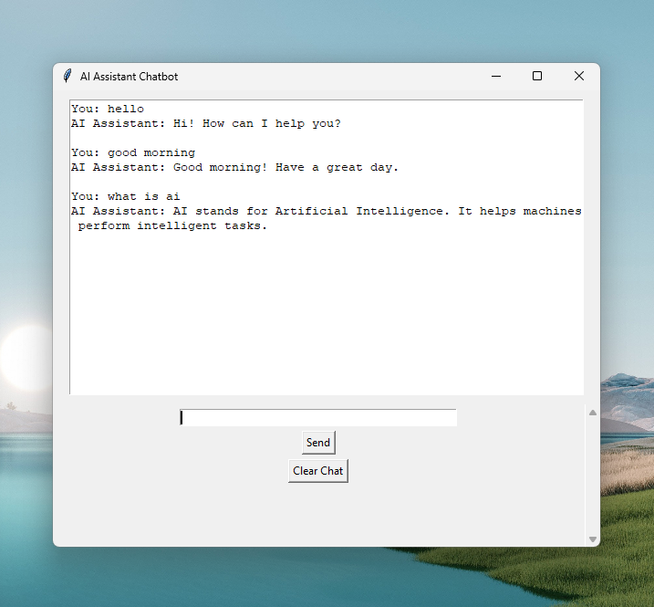

# 🤖 AI Assistant Chatbot

A beginner AI chatbot application built using Python, NLP, and Tkinter GUI.

## 📸 Demo Screenshot

## 🚀 Features

- 💬 Chat with AI Assistant
- 🧠 NLP text processing using NLTK
- 🖥️ Desktop GUI application
- 📚 50+ question-answer knowledge base
- ➕ Easy to add new responses
- ⚡ Fast Python-based chatbot

## 🛠️ Technologies Used

- Python 🐍
- NLTK (Natural Language Processing)
- Tkinter GUI
- JSON

## 📂 Project Structure

AI_Chatbot/

├── chatbot.py
├── gui_chatbot.py
├── questions.json
├── screenshot.png
└── README.md

## ▶️ How to Run

Install NLTK:
pip install nltk

Run:
python gui_chatbot.py

## 🎯 Learning Outcomes

Through this project I learned:

- Python programming
- Basic NLP concepts
- GUI development
- Git and GitHub workflow
- Building AI applications

## 👨‍💻 Author

B.Sc AI & ML Student